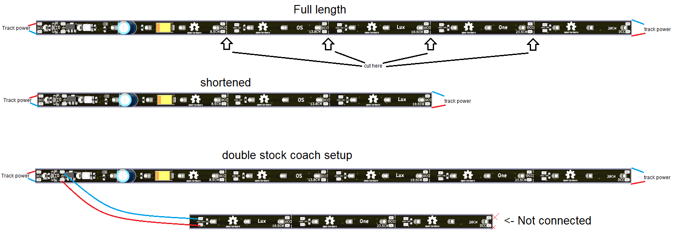

# OS-Lux-One Manual
💡 Universal modular LED strip for model railway lighting

## 🛠️ Overview
The OS-Lux-One is an open-source modular LED lighting strip for digital model railway systems 
It replaces multiple fixed-length coach strips with one universal version that can be shortened and reused for different coach types.
Each strip section contains its own current control to keep the light level steady, even when the track voltage changes.
The design is suitable for both H0 and N scale rolling stock.

---

## ✂️ Features
🔹 Modular & Cuttable
The strip can be shortened at the marked cut points.
Remaining pieces can be re-used by soldering wires to the power pads — ideal for double-deck coaches or other custom applications.
🔹 Stable Brightness
Each section has a built-in current regulator that keeps the LEDs equally bright at all times.
The strip works directly from the DCC track voltage (typically around 15–18 volts).
🔹 Integrated Capacitor
A small tantalum capacitor on the strip smooths out small interruptions or flicker on the track.
For extra stability, an external electrolytic capacitor (around 220 µF / 25 V) can be connected to the solder pads.
🔹 Brightness Adjustment
A small potentiometer allows manual adjustment of the light level.

---

## 🚂 Applications
    • Passenger coaches (H0 and N gauge)
    • Double-deck coaches
    • Buildings and station platforms
    • Other layout lighting

---

## 🔹 Wiring

The track power can be connected to any of the DCC pads (Note, MM2 or mFx also works). For wiring convenience the DCC pads are on both sides. The strip can route power through to the next strip. Even when shortened
Separated pieces can be powered with short wires, making the strip perfect for complex coach interiors or double-deck designs. The secondary strip can be pieces of a 2nd strip if more length is needed. It is likely that an H0 double deck coach will need two strips.

You can connect extra segements on the extra LED pads. The polarity is important. + goes to +, - goes to -.

---

## ⚠️ Notes
    • Connect with correct polarity when reusing separate pieces.
    • Intended for digital model railway layouts.
    • Works best with a track voltage of 15–18 V
